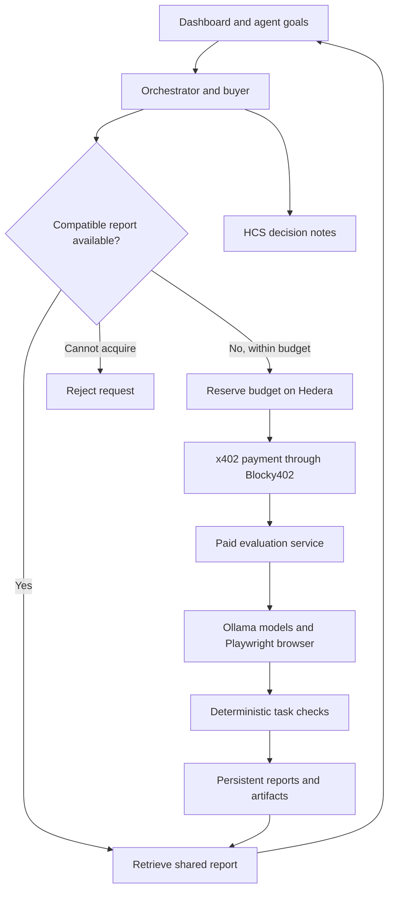

# Common

**Evaluate open models. Share the evidence. Pay once for work agents can reuse.**

Common is a shared spending memory for AI agents choosing open models. It compares models on real browser tasks, stores the measured results, and lets another agent reuse a compatible report instead of purchasing the same evaluation again.

Built for ETHOnline 2026 using Hedera, x402, Ollama and Playwright.

[Explore the demo](https://common.34.71.68.115.sslip.io/) · [Evaluation service](https://eval.34.71.68.115.sslip.io/) · [Verified cloud evidence](docs/evidence/cloud-deployment-2026-09-12.json) · [Setup and recovery](docs/ENVIRONMENT.md)

## Why Common

Choosing an open model requires evidence about how it performs on the work you actually need. Model size and benchmark scores alone do not tell you whether an agent can assign a support ticket, update its priority or resolve it correctly.

Running that evaluation costs inference time and browser execution. When several agents ask the same question, they should be able to share the answer.

Common connects three steps: deciding whether new evidence is needed, paying for a bounded evaluation when it is, and making the result reusable. Every recorded decision explains what was chosen, what was rejected and why.

## How it works

1. **Give an agent a goal and a budget.** The buyer selects buy, reuse or reject using the available report metadata and spending limits.
2. **Check shared memory.** Reuse requires workspace access, an exact configuration match, a fresh report and successful delivery.
3. **Reserve and purchase when needed.** A Solidity contract records the budget reservation. In testnet mode, the service settles an x402 payment through Blocky402 before starting evaluation.
4. **Run the models in a browser.** Each model chooses actions against the bundled support-desk application. Deterministic checks inspect the resulting application state.
5. **Store and share the evidence.** Reports include task outcomes, latency, token usage, model revisions, screenshots and browser traces. A subsequent agent can retrieve the same compatible report without another evaluation payment.
6. **Publish the decision trail.** In testnet mode, HCS records decision notes, with publication references linked to contract events.

The current suite compares **Qwen3 1.7B** and **Qwen3 4B** on five tasks: assigning a team, changing ticket priority, resolving a ticket, adding an exact note and filtering the ticket list.

The buyer and the evaluated models have different roles. The optional buyer uses an OpenAI-compatible API to decide whether to acquire evidence. The models under evaluation run through Ollama. A deterministic buyer policy is available without an API key and is used as a fallback when the hosted buyer is unavailable.

## Explore the live demo

Open the [Common dashboard](https://common.34.71.68.115.sslip.io/) without a password to inspect existing results.

| View | What to explore |
| --- | --- |
| Overview | Completed evaluations, reuse rate, purchase totals and recent activity |
| Agent console | Agent decisions and messages about acquisition, reuse, payment and delivery |
| Evaluation lab | Evaluation operations and task progress |
| Evidence | Model comparisons, individual checks, screenshots and downloadable traces |
| Decision memory | Recorded choices, reasoning and HCS publication references |
| Ledger | Operation states and Hedera payment receipts |

Public visitors have read-only access. Operators can [sign in](https://common.34.71.68.115.sslip.io/login) to start evaluations or resume operations. The provider separately protects job preparation with a service key and report retrieval with per-job tokens.

The application, evaluation service, models and Chromium run on Google Cloud independently of the development laptop. This hackathon VM is scheduled to stop around **September 15, 2026 at 23:43 IST** unless its runtime is extended.

## Verified results

The recorded cloud verification on September 12, 2026 completed one paid evaluation and one subsequent reuse:

| Measurement | Observed result |
| --- | --- |
| Evaluation purchase | 0.5 testnet HBAR through x402 and Blocky402 |
| Model/task executions | 10 across two models and five tasks |
| Qwen3 1.7B | 2 of 5 tasks passed |
| Qwen3 4B | 5 of 5 tasks passed |
| Measured evaluation duration | 101.342 seconds |
| Infrastructure errors | 0 |
| Shared reuse | One retrieval with no second evaluation payment |
| Reuse rate for this demonstration | 50% |
| HCS decision notes | Three confirmed notes, sequences 6 through 8 |
| Restart recovery | Stored report and counters preserved after service restarts |

These results describe one recorded run on the cloud VM. They are not general model rankings or reliability guarantees. The live dashboard includes subsequent activity and may show different totals. Evidence files preserve the configuration and access conditions at the time of each verification.

[Cloud verification record](docs/evidence/cloud-deployment-2026-09-12.json) · [Initial testnet verification](docs/evidence/live-evaluation-2026-09-12.json) · [Validation details](docs/VERIFICATION.md)

## Architecture



| Component | Responsibility |
| --- | --- |
| [Web](apps/web/) | Dashboard, agent console and evidence inspection |
| [Orchestrator](apps/orchestrator/) | Buyer decisions, workflow coordination, access and recovery |
| [Paid service](apps/paid-service/) | x402 verification, settlement and evaluation job delivery |
| [Evaluation runner](packages/evaluation-runner/) | Ollama inference, browser actions and task grading |
| [Hedera adapter](packages/hedera-adapter/) | Payment signing, contract calls, reconciliation and HCS |
| [Contracts](contracts/) | Workspace budgets, reservations and operation lifecycle |
| [Memory client](packages/memory-client/) | Workspace-scoped discovery and observed reuse counters |
| [Result store](packages/result-store/) | Persistent reports and retrieval |

Memory discovery currently uses SQLite. The Graph integration is deferred and is not part of the deployed flow.

## Run locally

### Requirements

- Node.js 24 LTS and npm
- [Ollama](https://ollama.com/) running locally
- Several GB of disk space for the two models and browser installation

```sh
git clone https://github.com/RudraBhaskar9439/common.git
cd common
npm ci
npx playwright install chromium
ollama pull qwen3:1.7b
ollama pull qwen3:4b
npm run preflight
npm run dev
```

If Ollama is not already running, start `ollama serve` in another terminal. Open **http://127.0.0.1:3000**.

A fresh checkout defaults to local inference and a deterministic buyer. No wallet, hosted model API key or blockchain payment is required. Optional configuration belongs in a root `.env` based on [`.env.example`](.env.example). Existing shell variables take precedence.

### Try the workflow

1. Open **Agent console** and select **Agent A**.
2. Enter a goal such as `Compare the two open models for our support-desk browser tasks.`
3. Set the budget to `2` and click **Send goal to agent**. With no compatible report, the default policy starts an evaluation.
4. After delivery, inspect the model comparison and task evidence.
5. Return to the console, select **Agent B**, keep the same evaluation configuration and click **Send goal to agent**. The fresh report is reused.
6. Use **Fresh measurement** when you explicitly want a new evaluation generation.

The budget is a request limit. In local mode, evaluations send no Hedera payments or HCS messages. In testnet mode, the configured evaluation price is charged for a new paid run. Free-form goal text guides the buyer's decision; it does not generate new tasks or change the supported model suite.

### Configuration

| Variable | Purpose |
| --- | --- |
| `COMMON_MODE` | `local` by default; `hedera-testnet` enables the configured paid workflow |
| `COMMON_DATA_DIR` | Persistent database and artifact location; defaults to `.common-data` |
| `COMMON_WORKSPACE_ID` | Workspace identity used for discovery and spending |
| `COMMON_BUYER` | `policy` or `openai` for the optional hosted buyer |
| `OPENAI_API_KEY`, `OPENAI_MODEL`, `OPENAI_BASE_URL` | Hosted buyer credentials and OpenAI-compatible endpoint |
| `COMMON_PUBLIC_REVIEW` | `yes` permits anonymous evidence browsing while protecting spending |
| `COMMON_OPERATOR_PASSWORD` | Operator access; public review requires at least 24 characters |
| `COMMON_READ_ONLY` | `yes` disables execution, startup recovery and transaction retries for everyone |

For testnet credentials, contract preparation and the two-process launch, follow the [environment runbook](docs/ENVIRONMENT.md). For HTTPS, persistent volumes and service configuration, use the [Google Cloud deployment guide](infra/deploy/README.md).

## Payment and recovery guarantees

- Reservations and retries use stable operation identities and bound payment parameters.
- Unknown settlement keeps the reservation claimed. Reconciliation checks the original transaction before the workflow continues.
- Payment and report delivery are separate outcomes. A paid job can be recovered without purchasing it again.
- HCS publication retries use a durable outbox and do not repeat payment. Consumers must deduplicate decision IDs.
- Reuse counters increase after report retrieval and validation. They represent observed reuse, not assumed savings.

The contract is an accounting ledger, not a custody vault. The operator holds the treasury signing key. Purchase budgets exclude network and contract fees. HCS establishes ordering and publication timing; it does not independently verify an agent's reasoning.

## Development and verification

```sh
npm ci --prefix contracts
npm run test:all
```

The suite covers interfaces, workflow recovery, API access, contract behavior, browser execution and the dashboard journey. Fixture tests are explicitly labeled and do not establish live blockchain behavior. The full test suite does not require funded wallets or downloaded Ollama models.

To measure actual local inference and report reuse with both models installed:

```sh
npm run measure:reuse
```

Keep `.common-data` between restarts to preserve reports and recovery state. Run one application worker and one provider worker per respective database.

## Scope

Common is a single-workspace hackathon deployment with two supported models and a controlled browser application. It uses bounded-job pricing rather than per-token billing. Broader model coverage, arbitrary browser targets, public job admission and multi-tenant operation are outside the current implementation.

## Project documentation

- [Repository map](docs/FILE_MAP.md)
- [Team workflow](CONTRIBUTING.md)
- [Architecture decisions](docs/DECISIONS.md)
- [Build plan](docs/BUILD_PLAN.md)
- [Demo guide](docs/DEMO.md)
- [Environment and recovery](docs/ENVIRONMENT.md)
- [Deployment](infra/deploy/README.md)
