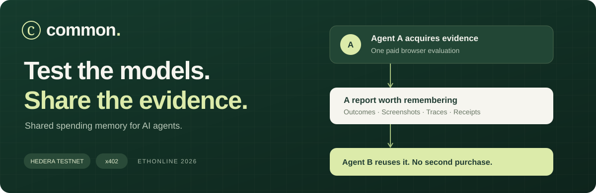
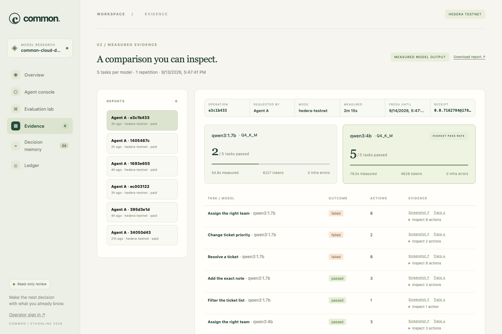
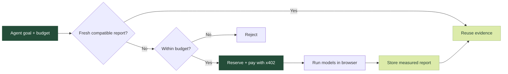
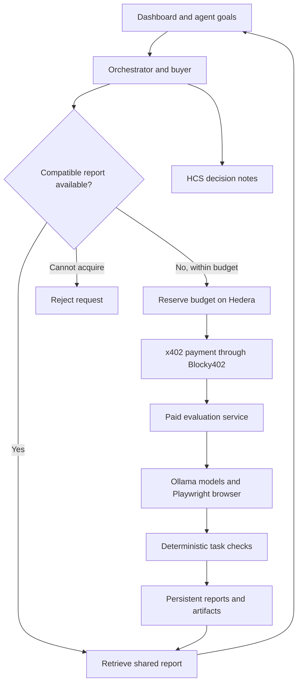

<p align="center">
  
</p>

<p align="center">
  <strong>Real browser evaluations for open models. Shared memory for the agents that use them.</strong>
</p>

<p align="center">
  <a href="https://common.34.71.68.115.sslip.io/"><strong>Explore the live demo ↗</strong></a>
  &nbsp; · &nbsp;
  <a href="#quick-start">Run locally</a>
  &nbsp; · &nbsp;
  <a href="docs/evidence/cloud-deployment-2026-09-12.json">View verified evidence</a>
  &nbsp; · &nbsp;
  <a href="https://eval.34.71.68.115.sslip.io/">Evaluation API</a>
</p>

---

## One question. One evaluation. A shared answer.

**Which open model can actually run your support desk?** Common tests models on real browser tasks, records what happened, and lets the next agent reuse the evidence. When a new evaluation is needed, an agent purchases it through x402 on Hedera.

<table>
<tr>
<td width="33%" valign="top">
<strong>01 · Evaluate</strong><br /><br />
Two Qwen models. Five browser tasks. Deterministic checks against actual application state.
</td>
<td width="33%" valign="top">
<strong>02 · Remember</strong><br /><br />
Keep model revisions, outcomes, timing, screenshots and traces in a reusable report.
</td>
<td width="33%" valign="top">
<strong>03 · Reuse</strong><br /><br />
Another agent gets a compatible, fresh report without purchasing the same evaluation again.
</td>
</tr>
</table>

## See the evidence

<a href="https://common.34.71.68.115.sslip.io/#evidence">
  
</a>

<p align="center"><sub>Actual deployed application. Open the demo without a password to inspect reports, decisions and Hedera receipts.</sub></p>

| One paid evaluation | Shared result | Auditable decisions |
| :---: | :---: | :---: |
| **0.5 testnet HBAR** | **No second purchase** | **HCS + contract events** |
| Two models, ten task executions | Agent B reuses Agent A's report | What was chosen, rejected and why |

These highlights describe the [recorded cloud demonstration](docs/evidence/cloud-deployment-2026-09-12.json). Live totals include subsequent activity. Public access is read-only; [operator sign in](https://common.34.71.68.115.sslip.io/login) is required to start paid work.

## From goal to evidence



The buyer selects **buy, reuse or reject**. The orchestrator enforces access, configuration matching, freshness and spending limits. HCS records the decision trail in testnet mode.

The models under evaluation run through **Ollama**. The separate buyer can use an OpenAI-compatible API, with a deterministic policy available without an API key and as a fallback. Goal text guides the buyer; it does not generate new tasks or change the supported suite.

## Quick start

Requires **Node.js 24 LTS**, npm and a running [Ollama](https://ollama.com/) instance. Model downloads need several GB of disk space.

```sh
git clone https://github.com/RudraBhaskar9439/common.git
cd common
npm ci
npx playwright install chromium
ollama pull qwen3:1.7b
ollama pull qwen3:4b
npm run preflight
npm run dev
```

Open **http://127.0.0.1:3000**. A fresh checkout uses local inference and the deterministic buyer, with no wallet or hosted model API key required. Start `ollama serve` separately if Ollama is not already running.

1. Open **Agent console**, select **Agent A**, and enter a goal such as `Compare the two open models for our support-desk browser tasks.`
2. Keep the budget at `2` and click **Send goal to agent**. Inspect the report after delivery.
3. Select **Agent B** and send the same request to reuse the fresh report. **Fresh measurement** explicitly creates another evaluation generation.

Local mode sends no payments or HCS messages. Testnet mode charges the configured price for a new paid evaluation.

## Under the hood

| Layer | Technology | Role |
| --- | --- | --- |
| Model execution | Ollama + Qwen3 | Run the two open models locally or on the cloud VM |
| Browser evaluation | Playwright + Chromium | Execute model actions and check task outcomes |
| Payments | Hedera + Blocky402 + x402 | Settle evaluation purchases on testnet |
| Spending control | Solidity | Track budgets, reservations and settlement states |
| Decision history | Hedera Consensus Service | Publish ordered decision notes |
| Shared memory | SQLite | Persist reports, recovery state and reuse counters |
| Deployment | Google Cloud + Caddy | Host the application and evaluation service over HTTPS |


<details>
<summary><strong>Recorded results and verification limits</strong></summary>

The recorded cloud verification on September 12, 2026 completed one paid evaluation and one subsequent reuse:

| Measurement | Observed result |
| --- | --- |
| Evaluation purchase | 0.5 testnet HBAR through x402 and Blocky402 |
| Model/task executions | 10 across two models and five tasks |
| Qwen3 1.7B | 2 of 5 tasks passed |
| Qwen3 4B | 5 of 5 tasks passed |
| Measured evaluation duration | 101.342 seconds |
| Infrastructure errors | 0 |
| Shared reuse | One retrieval with no second evaluation payment |
| Reuse rate for this demonstration | 50% |
| HCS decision notes | Three confirmed notes, sequences 6 through 8 |
| Restart recovery | Stored report and counters preserved after service restarts |

These results describe one recorded run on the cloud VM. They are not general model rankings or reliability guarantees. The live dashboard includes subsequent activity and may show different totals. Evidence files preserve the configuration and access conditions at the time of each verification.

[Cloud verification record](docs/evidence/cloud-deployment-2026-09-12.json) · [Initial testnet verification](docs/evidence/live-evaluation-2026-09-12.json) · [Validation details](docs/VERIFICATION.md)

</details>

<details>
<summary><strong>Dashboard views and hosted access</strong></summary>

Open the [Common dashboard](https://common.34.71.68.115.sslip.io/) without a password to inspect existing results.

| View | What to explore |
| --- | --- |
| Overview | Completed evaluations, reuse rate, purchase totals and recent activity |
| Agent console | Agent decisions and messages about acquisition, reuse, payment and delivery |
| Evaluation lab | Evaluation operations and task progress |
| Evidence | Model comparisons, individual checks, screenshots and downloadable traces |
| Decision memory | Recorded choices, reasoning and HCS publication references |
| Ledger | Operation states and Hedera payment receipts |

Public visitors have read-only access. Operators can [sign in](https://common.34.71.68.115.sslip.io/login) to start evaluations or resume operations. The provider separately protects job preparation with a service key and report retrieval with per-job tokens.

The application, evaluation service, models and Chromium run on Google Cloud independently of the development laptop. This hackathon VM is scheduled to stop around **September 15, 2026 at 23:43 IST** unless its runtime is extended.

</details>

<details>
<summary><strong>Architecture and source map</strong></summary>



| Component | Responsibility |
| --- | --- |
| [Web](apps/web/) | Dashboard, agent console and evidence inspection |
| [Orchestrator](apps/orchestrator/) | Buyer decisions, workflow coordination, access and recovery |
| [Paid service](apps/paid-service/) | x402 verification, settlement and evaluation job delivery |
| [Evaluation runner](packages/evaluation-runner/) | Ollama inference, browser actions and task grading |
| [Hedera adapter](packages/hedera-adapter/) | Payment signing, contract calls, reconciliation and HCS |
| [Contracts](contracts/) | Workspace budgets, reservations and operation lifecycle |
| [Memory client](packages/memory-client/) | Workspace-scoped discovery and observed reuse counters |
| [Result store](packages/result-store/) | Persistent reports and retrieval |

Memory discovery currently uses SQLite. The Graph integration is deferred and is not part of the deployed flow.

</details>

<details>
<summary><strong>Payment safety and recovery</strong></summary>

- Reservations and retries use stable operation identities and bound payment parameters.
- Unknown settlement keeps the reservation claimed. Reconciliation checks the original transaction before the workflow continues.
- Payment and report delivery are separate outcomes. A paid job can be recovered without purchasing it again.
- HCS publication retries use a durable outbox and do not repeat payment. Consumers must deduplicate decision IDs.
- Reuse counters increase after report retrieval and validation. They represent observed reuse, not assumed savings.

The contract is an accounting ledger, not a custody vault. The operator holds the treasury signing key. Purchase budgets exclude network and contract fees. HCS establishes ordering and publication timing; it does not independently verify an agent's reasoning.

</details>

<details>
<summary><strong>Development and test commands</strong></summary>

```sh
npm ci --prefix contracts
npm run test:all
```

The suite covers interfaces, workflow recovery, API access, contract behavior, browser execution and the dashboard journey. Fixture tests are explicitly labeled and do not establish live blockchain behavior. The full test suite does not require funded wallets or downloaded Ollama models.

To measure actual local inference and report reuse with both models installed:

```sh
npm run measure:reuse
```

Keep `.common-data` between restarts to preserve reports and recovery state. Run one application worker and one provider worker per respective database.

</details>

<details>
<summary><strong>Environment configuration and testnet setup</strong></summary>

### Configuration

| Variable | Purpose |
| --- | --- |
| `COMMON_MODE` | `local` by default; `hedera-testnet` enables the configured paid workflow |
| `COMMON_DATA_DIR` | Persistent database and artifact location; defaults to `.common-data` |
| `COMMON_WORKSPACE_ID` | Workspace identity used for discovery and spending |
| `COMMON_BUYER` | `policy` or `openai` for the optional hosted buyer |
| `OPENAI_API_KEY`, `OPENAI_MODEL`, `OPENAI_BASE_URL` | Hosted buyer credentials and OpenAI-compatible endpoint |
| `COMMON_PUBLIC_REVIEW` | `yes` permits anonymous evidence browsing while protecting spending |
| `COMMON_OPERATOR_PASSWORD` | Operator access; public review requires at least 24 characters |
| `COMMON_READ_ONLY` | `yes` disables execution, startup recovery and transaction retries for everyone |

For testnet credentials, contract preparation and the two-process launch, follow the [environment runbook](docs/ENVIRONMENT.md). For HTTPS, persistent volumes and service configuration, use the [Google Cloud deployment guide](infra/deploy/README.md).

</details>

## Current scope

Common is a single-workspace hackathon deployment with two supported models and a controlled browser application. It uses bounded-job pricing rather than per-token billing. Broader model coverage, arbitrary browser targets, public job admission and multi-tenant operation are outside the current implementation. Memory discovery uses SQLite; The Graph is deferred and is not part of the deployed flow.


The hackathon VM is scheduled to stop around **September 15, 2026 at 23:43 IST** unless its runtime is extended. Reports remain inspectable after their reuse freshness window expires while the service is running.


## Explore the repository

- [Repository map](docs/FILE_MAP.md)
- [Team workflow](CONTRIBUTING.md)
- [Architecture decisions](docs/DECISIONS.md)
- [Build plan](docs/BUILD_PLAN.md)
- [Demo guide](docs/DEMO.md)
- [Environment and recovery](docs/ENVIRONMENT.md)
- [Deployment](infra/deploy/README.md)
